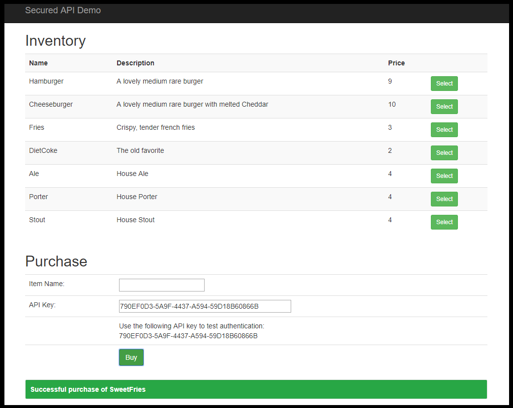

# Token-based Secured Web API Demonstration

## About this project
This project demonstrates a .NET Web API project that uses token-based security.  

It simulates a store that has an inventory.  Authorized users with a valid token can purchase an item, which will remove it from the inventory.

## API Description

This project contains two REST API endpoints - one for getting the current inventory, and one for making a purchase.  

As with any classic RESTful API, the endpoints are nouns - in this case, "Items" and "Purchase" 

### GET /api/items
This unauthenticated API endpoint will return a JSON array of items, with each item having a name, a description, and a price.

Example:

    GET /api/items

    Returns:
    [
        {
            "Name": "Hamburger",
            "Description": "A lovely medium rare burger",
            "Price": 9
        },
        {
            "Name": "Porter",
            "Description": "House Porter",
            "Price": 4
        },
        {
            "Name": "Stout",
            "Description": "House Stout",
            "Price": 4
        }
    ]

### POST /api/purchase/{itemName}
This API endpoint is available only to authenticated users (i.e., those with a valid token ID in the request header).  The token must be included in the Authorization header, with a value of 'Bearer {tokenID}'.

If the {itemName} isn't currently found in the inventory, a BadRequest error will be returned.

If the purchase succeeds, the item will be removed from the current inventory, and an object representing the new object will be returned, in classic REST style.

Example:

    POST /api/purchase/Ale

    Returns:
    {
        "Name": "Ale",
        "Description": "House Ale",
        "Price": 4
    }

## Security Approach
There are several possible approaches to securing a public web API:

Approach | Pros | Cons
--- | --- | ---
Token-based | Easy to use from a consumer perspective.  No expiration period means no need to re-authenticate. | If the user accidentally exposed the token, others could use it.  Requires registration and delivery of token to user prior to them using the API.
Windows authentication | Effortless when in an Intranet environment | Not useful for public APIs.
OAuth Social login | No preliminary registration needed.  Easy from a user perspective. | Users are essentially anonymous unless permission is granted to obtain their email or other identifying info.  No easy way to restrict certain users.
OAuth Local login | Allows detailed control of token expiration | Requires users to register and/or login to gain a token.

For this project, a simple token-based authentication is used.  The token is created and provided to the user before they can use the API.  This technique is common and used by companies like Google for Google Maps API access.  In this case, a simple GUID is used as the token.

Since the API is public, cross-origin requests (CORS) must be allowed.  This is done in WebApiConfig.cs by creating a new `EnableCorsAttribute` and calling `EnableCors` on the config object.

Tokens are typically sent in every message header.  Because of this, all calls to the web API must come through HTTPS, so the token cannot be seen using a packet sniffer.  This project contains a filter than ensures that an HTTPS connection is being used, except for when the `BuildIndicator` AppSetting is set to "DEV".

## Testing
The included web app can be used to test the web API.  It initially calls the `GET api/items` endpoint when the page is first loaded, and also calls the API when a purchase is made.  

Beyond that, unit tests are provided that test both controllers, and the required mocked data source class.  The controllers use dependency injection to swap out the standard data source class with a mocked version.  

In cases where an actual database is needed for the mocked data, I typically like to use a LocalDB database on my development machine, assuming the actual development database is located elsewhere.  When using Code First Entity Framework, I set up Migrations to track schema changes.  Those migrations can then be used with the LocalDB mock database.

## Technical Notes
For error trapping, I like to use Elmah.  It provides a simple way to trap errors and either write XML log files (as is done in this project), send error emails, and much more.  It's all controlled by settings in web.config.  One small difference between a regular ASP.NET application and a Web API is that usually 500 errors are sent back to the client from a Web API, rather than being unhandled and therefore caught by Elmah.  Because of this, I've added an UnhandledExceptionFilter class that explicitly passes the error to Elmah.

